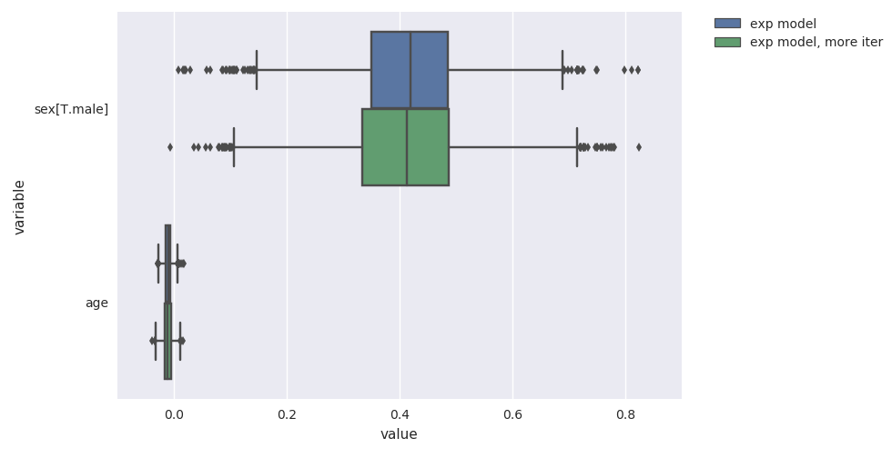
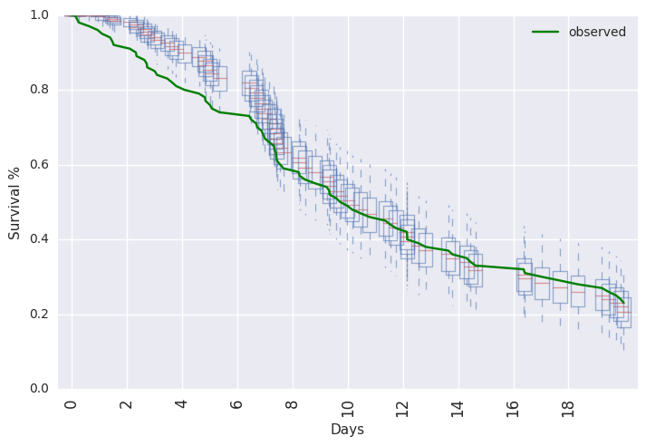
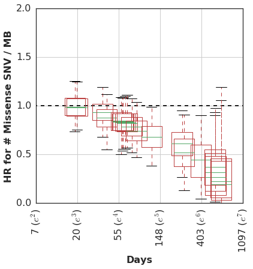

Survival analysis is an important and useful tool in biostatistics. It is commonly used in the analysis of clinical trial data, where the **time to a clinical event** is a primary endpoint. This endpoint may or may not be observed for all patients during the study's follow-up period.

At the core of survival analysis is the observation that the observed _time to event_ $t$ is the result of an accumulation of event-related risks at each moment up to that time $t$. Factors that modify the time to event do so by reducing or increasing the instantaneous risk of the event in a particular time period.

The basic survival model posits quite an elegant relationship between covariates and the dependent variable. In addition, there are several analytical problems that survival analysis attempts to address, which may not be obvious at first glance.

Among these, I would highlight the following:

1. **Time-dependent risk sets**: At each time _t_, only a subset of the study population is at risk for the event of interest. For example, if the primary endpoint is _death_, we should only expect to observe this event among patients who are alive at a time _t_.  The calculation of an _event rate_ at any point during follow-up should consider only those patients eligible for the event.

2. **Censoring of events**: Typically there is a subset of patients for whom the primary endpoint was not observed.  For these patients, the endpoint is said to be _censored_. For these patients who did not experience an event, all we know is the last time that patient was observed event-free.

One of the most common approaches to survival analysis is the Cox Proportional Hazards (Cox PH) model, which was first proposed by David Cox in a 1972 publication. However, survival modeling and particularly Bayesian survival modeling continues to be an area of active research. There are several more recent developments which we are interested in applying to our research, which aims to discover biomarkers for response to immune checkpoint blockade in the context of cancer.

In particular:

- [competing risk](https://cran.r-project.org/web/packages/survival/vignettes/compete.pdf) and [semi-competing risk](https://www.ncbi.nlm.nih.gov/pubmed/25274445) models
- [joint modeling](http://www.jstor.org/stable/24307417) of longitudinal and time-to-event outcomes
- [gaussian process approaches](https://arxiv.org/pdf/1611.00817.pdf) to modeling baseline hazards and [covariate effects](http://mlpm.eu/static/media/uploads/Summer%20School%202015/vehtari_gpsurvival_201509.pdf) more flexibly
- utilizing external populations to stabilize baseline hazard estimates, as done in [Peltola et al](http://becs.aalto.fi/en/research/bayes/publications/Peltola_etal_bmaw2014.pdf)'s analysis
- [varying-coefficient](http://www.tandfonline.com/doi/abs/10.1080/10543406.2015.1052493) and stratified hazard models, which can support individual patient-level meta-analysis or block-randomized study designs
- adding regularizing priors on covariate effects, as illustrated in the [github repo](https://github.com/to-mi/stan-survival-shrinkage) from Peltola et al's analysis
- models including non-linear effects, time-varying covariates, and [time-dependent effects](https://cran.r-project.org/web/packages/survival/vignettes/timedep.pdf)
- modeling [errors-in-variables](https://en.wikipedia.org/wiki/Errors-in-variables_models) in the context of Survival analysis. This is particularly applicable to the analysis of genetic features inferred from sequencing data, where the uncertainty in the estimate may vary among patients.

We developed [SurvivalStan](https://github.com/hammerlab/survivalstan) in order to support our own work implementing many of the methods described above in [Stan](https://mc-stan.org) and applying them to analysis of cohorts treated with immunotherapy.

In the following introduction, we will give a brief introduction to Survival analysis and the standard set of assumptions made by this approach. We will then illustrate applied examples from our own research, including:

1. A piecewise exponential model
2. A varying-coefficient analysis
3. Estimation of time-dependent effects

Many of these examples (and more) are included in the [documentation for SurvivalStan](https://jburos.github.io/survivalstan/index.html), available online. We welcome feedback on this package in our [github repo](https://github.com/hammerlab/survivalstan).

## Motivations

Many of the methods described above have been implemented in user-friendly packages in [R](https://www.r-project.org/), so one may argue that we don't need yet another package for survival analysis.  However, these packages are in some ways too robust for our use case.

In our research we need to be able to *iterate on the model* fairly quickly.  Also, given the considerable complexity of the models and our interest in exploring the full posteriors of said models, we want to use [NUTS](https://arxiv.org/abs/1111.4246) and [Stan](http://mc-stan.org) to fit our models. Having a number of modeling approaches fit using the same inference algorithm allows one to do better model comparison.

We also want it to be easy to *apply the models to a dataset* for publication or discussion. In support of this goal, we have included a set of functions for pre-processing data and for summarizing parameter estimates from the model.

We finally value reliability of the models and so have made efforts to *check the models against simulated data* routinely, as part of our travis tests. There is (always!) more work to be done in this area, so use your judgement when applying these models, but the main pieces of this are in place.

It is our hope that other researchers will find the package useful, and that some may even contribute additional models according to their application.

## Leveraging the power of Stan

We have therefore designed [Survivalstan](http://github.com/hammerlab/survivalstan) with a goal of:

1. Supporting common tasks in Survival modeling, such as preparing data for analysis or summarizing posterior inference
2. Provide Stan code for standard models, where each model is a single file that can be edited for specific applications
3. Allow the user to supply a custom Stan model, to enable a greater range of options than those supplied by default
4. Provide a robust testing environment to encourage routine checking of models against simulated data

This paradigm breaks with that utilized by some of the excellent packages which expose Stan models for wider consumption such as [rstanarm](http://mc-stan.org/interfaces/rstanarm), which (a) pre-compile models on package install, and (b) utilize complicated logic within the stan code for computational efficiency and to support a wide variety of user options. These design decisions make sense for that use case, but not for ours.

By comparison, the Stan code included in SurvivalStan is focused on a particular model and so is only as complex as that model demands. Flexibility is instead supported by including more Stan files (roughly one per baseline hazard type) and by supporting direct editing of any of these Stan files. The expectation is that users will be fairly sophisticated -- that is, familiar with the Bayesian modeling process, how to [evaluate convergence](http://www.mcmchandbook.net/HandbookChapter6.pdf), and the importance of [model checking](www.stat.columbia.edu/~gelman/research/published/w2.pdf).

What [SurvivalStan](http://github.com/hammerlab/survivalstan) instead provides are utilities for data preparation for analysis, calling out to [pystan](https://pystan.readthedocs.io/en/latest/) to fit the model, and summarizing results of the fitted models in a manner appropriate for survival analysis.

Below we will work through some examples illustrating the variety of models one can fit using SurvivalStan. Reproducible code is available in the [example-notebooks](http://nbviewer.jupyter.org/github/hammerlab/survivalstan/tree/master/example-notebooks/) included in the package repo.

## A Very Brief Introduction to Survival Modeling

Let's start with a brief introduction to establish key terms.

Recall that, in the context of survival modeling, we have two functions :

1. A function for **Survival ($S$)**, ie the probability of surviving to time $t$:

	$$  S(t)=Pr(Y > t) $$

	where the true Survival time is _Y_.

2. A function for the **instantaneous *hazard* $\lambda$**, ie the probability of a failure event occuring in the interval [$t$, $t+\delta t$], given that a patient has survived to time $t$:

	$$ \lambda(t) =  \lim_{\delta t \rightarrow 0 } \; \frac{Pr( t \le Y \le t + \delta t | Y > t)}{\delta t} $$

By definition, these two are related to one another by the following equation:

$$ \lambda(t) = \frac{-S'(t)}{S(t)} $$

(If you're not familiar with survival modeling, it's worth pausing here for a moment to consider why this is the case.)

Solving this, yields the following:

$$ S(t) = \exp\left( -\int_0^t \lambda(z) dz \right) $$

The integral in this equation is also sometimes called the *cumulative hazard*, here noted as $H(t)$.

$$ H(t) = \int_0^t \lambda(z) dz $$

It's worth pointing out that, by definition, the cumulative hazard (estimating $Pr(Y \lt t)$) is the complementary c.d.f of the Survival function (which estimates $Pr(Y \ge t)$).

### Simulating some data

The simplest of all survival models assumes a constant hazard over time.

For example :

  $$ \lambda(t) = a $$

Given this hazard, our cumulative hazard ($H$) would be:

  $$ H(t) = \int_0^t \lambda(z) dz = at $$

And our Survival function ($S$) would be:

  $$ S(t) = \exp\left( -\int_0^t \lambda(z) dz \right) = \exp ( − a t ) $$

We can simulate the Survival time according to this model in Python using `np.random.exponential(-1*a*t)`.

This is implemented as a function in [survivalstan](http://github.com/hammerlab/survivalstan) as `sim_data_exp`.

```python
import survivalstan
df = survivalstan.sim.sim_data_exp(censor_time = 50, N = 200, rate = 0.1)
```

Plotting these data (thanks to [lifelines](https://lifelines.readthedocs.io/)) as a KM curve yields

```python
survivalstan.utils.plot_observed_survival(df, time_col='t', event_col='event')
```


We can additionally simulate data where the **hazard is a linear combination of covariate effects**.

For example, where the hazard rate is a function of sex:

```python
df2 = survivalstan.sim.sim_data_exp_correlated(
    N=500, censor_time=20, rate_form='1 + sex', rate_coefs=[-3, 0.5])
```

This would yield the following survival curves:

```python
from matplotlib import pyplot as plt
survivalstan.utils.plot_observed_survival(
    df2.query('sex == "female"'),
    time_col='t',
    event_col='event',
    label='female')
survivalstan.utils.plot_observed_survival(
    df2.query('sex == "male"'),
    time_col='t',
    event_col='event',
    label='male')
plt.legend()
```


### Fitting a Survival Model

We are now ready to fit our model to the simulated data.

To start with, we will fit a parametric exponential baseline hazard model -- the same parameterization as we used to simulate our data:

```python
fit1 = survivalstan.fit_stan_survival_model(
    df=df2,
    time_col='t',
    event_col='event',
    model_code=survivalstan.models.exp_survival_model,
    formula='~ age + sex',
    model_cohort = 'exp model'
)
```

### Reviewing convergence

Summarizing posterior draws for key parameters, we see that the R-hat values are not great (R-hat is a rough indicator that your model is sampling well from the posterior distribution; values close to 1 are good):

```python
survivalstan.utils.filter_stan_summary([fit1], pars=['lp__','beta'])
```


In some cases, it can be helpful to plot the distribution of R-hat values over the set of parameters estimated. This can help highlight parameters that are not being sampled well.

### Updating the model

A trivial way to update a model is to increase the number of iterations:

```python
fit2 = survivalstan.fit_stan_survival_model(
    df=df2,
    time_col='t',
    event_col='event',
    model_code=survivalstan.models.exp_survival_model,
    formula='~ age + sex',
    iter = 5000,
    chains = 4,
    model_cohort = 'exp model, more iter'
)
```

In the context of SurvivalStan, we use the parameter `model_cohort` to provide a descriptive label of either the model or the subset of data to which the model has been fit.

This is not sufficient to resolve our convergence problems.

```python
survivalstan.utils.filter_stan_summary([fit2], pars=['lp__','beta'])
```


It is, however, good enough to illustrate our use case.

### Summarizing posterior draws

You will notice that the functions above accept a list of fit objects, rather than a single fit object.

Most of the functions in SurvivalStan accept lists of models, since the typical modeling workflow is an iterative process.

For example, you can use the `plot_coefs` function to plot beta-coefficient estimates from one or several models:

```python
survivalstan.utils.plot_coefs([fit1, fit2])
```


These are named/grouped according to the optional parameter `model_cohort`, which was provided when we fit the model.

### Posterior predictive checks

SurvivalStan includes a number of utilities for model-checking, including posterior predictive checking.

This can be done graphically:

```python
survivalstan.utils.plot_pp_survival([fit3], fill=False)
survivalstan.utils.plot_observed_survival(df=df2, event_col='event', time_col='t', color='green', label='observed')
plt.legend()
```



Or, posterior predictive summaries can be retrieved as a [pandas](https://pandas.python.org) dataframe. They are then available to be summarized or plotted more flexibly.

For example, in [Test PEM model against simulated data.ipynb](https://github.com/hammerlab/survivalstan/blob/master/example-notebooks/Test%20pem_survival_model%20with%20simulated%20data.ipynb) we demonstrate how to extract the predicted values and plot them using [http://plot.ly](http://plot.ly):

[]("https://plot.ly/~jackinovik/146/?share_key=zyd1cnujllcG4m0MNV4v8A")

### Standard assumptions

We conclude this section introducing survival modeling by summarizing the key assumptions made by survival analysis, and their potential implications.

1. The most widespread assumption made by survival modeling is that **the event _will eventually occur_ for all patients in the study**. The technique is called "survival modeling" because the classic endpoint of interest was death, which is guaranteed to happen _eventually_.

    However, for many applications (e.g. disease recurrence or a purchase event) this assumption may not hold -- ie some people may never purchase that product. In cancer research, where the goal is to eventually cure a significant portion of the population, we are starting to see portions of the population who are effectively "cured", with near-zero disease recurrence risk up to 5 years following therapy. This is a good problem to have.

2. A second assumption is that the **censoring is non-informative**.  Censoring can occur for many reasons -- most often, and this is the best case, the study ends before all events are observed.  In other cases, there is a _competing event_ which leads to a patient being ineligible to continue in the study, or making it impossible to observe the primary clinical event. One example of a competing event in cancer research would be discontinuation of the drug due to toxicity. This type of event may be informative censoring, since the risk of the primary clinical event (ie mortality) may be different had the patient not experienced the toxicity.

    In practice, violations of this assumption can be problematic to diagnose since outcome data for censored observations are rarely available. Gross violations of this assumption can directly affect utility and generalizability of the model estimates, particularly if the competing event is endogenous (ie related to treatment response or potential outcome). A common approach to address this problem is to estimate a competing risks model, in order to model the informative censoring process.

3. Finally, there is the **proportional hazards** assumption, which states that covariate effects on the hazard are uniform over the follow-up time. This is predominantly a simplifying assumption, which dramatically improves the ability to estimate covariate effects for smaller sample sizes. In practice, we often have biologically or clinically motivated reasons to think it may be violated. We will illustrate an example of this below.

## More flexible baseline hazards

In addition to the assumptions noted above, we are also making a more obvious assumption that we have _the right model_ -- ie that our parameters are distributed as specified in the model.

When we simulate data, we have the confidence to know that our modeling assumptions aren't violated. However, this can be difficult to determine in practice.

One of the more critical parameterizations to get right is that of the [baseline hazard](https://en.wikipedia.org/wiki/Proportional_hazards_model#Specifying_the_baseline_hazard_function). The baseline hazard behaves like an intercept in a typical regression model. It describes the instantaneous hazard over time for the population in the absence of any covariate effects. Failure to get this right can lead to all sorts of pathologies whereby the excess variation in hazard not accounted for by your modeled baseline hazard will be absorbed into covariate effects, yielding invalid inferences and potentially misleading conclusions.

*Aside: This is not a concern when using a Cox PH model for example, because the coefficient values are estimated using MLE on a partial likelihood which does not include the baseline hazard. In a Bayesian analysis, however, we have the challenge of estimating the hazard as well as the coefficient effects.*

Most of the time, we do not have a prior belief on the distribution of the baseline hazard. We usually do not care that much about what the features of the baseline hazard look like (although perhaps we should!). Instead, we are concerned with making sure our inferences about coefficient values are valid.

We thus want a baseline hazard that is _sufficiently flexible_ to absorb any variation in the hazard over time which should not be attributed to covariate values. We also however want to _minimize the risk of overfitting_, so that our posterior predicted probabilities of survival are well calibrated. Many of the semi- or non-parametric approaches to modeling baseline hazards are very flexible with a penalty to impose the upper bound of complexity.

### Piecewise hazards

Many non-parametric approaches to modeling the baseline hazard either implicitly or explicitly model the data using piecewise hazards. The most popular of these is the piecewise-exponential model (PEM).

Currently, to fit this model in SurvivalStan, you must provide data in _long_, _denormalized_, or _start-stop_ format.

```python
dlong = survivalstan.prep_data_long_surv(
    df=df2, event_col='event', time_col='t')
dlong['age_centered'] = dlong['age'] - np.mean(dlong['age'])
```

This breaks our survival time into blocks, such that we have at least one clinical event within each block. We end up with data where each patient has N records, one for each block in which the patient is still at risk for an event.

We can now fit this model using `fit_stan_survival_model`, in a manner similar to that used above.

```python
fit3 = survivalstan.fit_stan_survival_model(
    model_cohort = 'pem model',
    model_code = survivalstan.models.pem_survival_model,
    df = dlong,
    sample_col = 'index',
    timepoint_end_col = 'end_time',
    event_col = 'end_failure',
    formula = '~ age_centered + sex',
    iter = 5000,
    chains = 4,
    )
```

### Varying-coefficient models

**Interaction effects** are often biologically and clinically compelling results, and most detailed hypothesis imply the existence of one or several interaction effects. A search for predictive biomarkers often involves looking for biomarkers that interact with treatment, for example. And any hypothesis proposing that both X and K are required for benefit from treatment implies a three-way interaction.

However, interaction effects suffer from reduced power -- the power to detect an interaction effect is roughly 1/4 of that to detect a main effect of similar magnitude. And many of the exploratory biomarker analyses are underpowered for their main effects, in part due to expense and inconvenience of collecting biomarker data.

It can also be challenging to know, as an analyst, where to draw the line between searching for interaction effects which are biologically plausible, and mining the data for spurious "significant" findings. How to correct for multiple testing in this context? In any particular dataset, there are often a number of plausible interactions, some of which may yield significant findings by chance alone. Finally, parameter estimates within interaction subgroups can be unstable due to small numbers of subjects within combinations of groups.

A **varying-coefficient analysis** offers some of the benefits of interaction effects while mitigating (but not completely eliminating) the risks. It provides an intermediate ground between the two extremes of a full interaction, where effects are completely separate among groups, and no interaction, where effects are identical across groups. Instead, a varying-coefficient model results in what's called [partial pooling](http://andrewgelman.com/2004/10/26/partial_pooling/), where covariate effects can vary according to a group indicator, but only to the degree supported by the data and the model. Regarding the second point, in small sample sizes we often put a prior on the degree of variance across groups, reducing the likelihood for spurious interaction effects.

#### Example analysis

In an analysis we recently [published](http://journals.plos.org/plosmedicine/article?id=10.1371/journal.pmed.1002309), we included results from a varying-coefficient model. This analysis was conducted among a population of 26 patients with metastatic urothelial carcinoma treated with Atezolizumab, an anti-PD-L1 antibody. PD-L1 is a cell surface molecule that acts to suppress the anti-tumor activity of the immune system, so the hypothesized mechanism of drug action is to enhance the anti-tumor immune response by blocking this molecule's binding to PD-1.

In this cohort, the response to the drug was higher among patients with high levels of PD-L1 expression on their tumor-infiltrating immune cells (IC2), than among patients with low or no detectable PD-L1 expression (IC1 and IC0, respectively). This makes biological sense -- one would assume patients with PD-L1 expression would be more likely to respond to an anti-PD-L1 drug. What was surprising in this result is that there was _also_ a response among the IC1 and IC0 patients, albeit at a lower level.

In this context, we hypothesized that mutation burden may also be associated with response, since mutated proteins provide the antigens recognized by the immune cells in their anti-tumor activity. In the absence of PD-L1 expression, mutation burden may be minimally associated with survival. In the presence of PD-L1 expression, however, patients with higher mutation burden may show an improved survival following therapy than patients with lower mutation burden.

We used [SurvivalStan](http://github.com/hammerlab/survivalstan) to fit a multivariate survival model where the coefficient that estimates the association of missense SNV count / MB with Progression-Free Survival could vary according to the level of PD-L1 expression.

Here are the results. This plot shows the estimated HR for Missense SNV Count / MB by PD-L1 expression level:


The association of mutation burden with Progression-Free Survival is highest (better survival with higher mutation burden) among patients with high PD-L1 expression, with lesser association among patients with lower levels of PD-L1 expression.

To fit this model using SurvivalStan, we used a model whose Stan code is archived with that repository but is now available in SurvivalStan as `pem_survival_model_varying_coefs`. You can see the model code [here](https://github.com/hammerlab/survivalstan/blob/master/survivalstan/stan/pem_survival_model_varying_coefs.stan).

To fit it, you would use the following:

```python
survivalstan.fit_stan_survival_model(
    df = df_long,
    formula = 'log_missense_snv_count_centered_by_pd_l1'
    group_col = 'pd_l1',
    model_code = survivalstan.models.pem_survival_model_varying_coefs,
    timepoint_end_col = 'end_time',
    event_col = 'end_failure',
    sample_col = 'patient_id',
    chains = 4,
    iter = 10000,
    grp_coef_type = 'vector-of-vectors',
    seed = seed
    )
```

See the [analysis notebook](https://github.com/hammerlab/multi-omic-urothelial-anti-pdl1/blob/master/analyses/notebooks/Interaction%20missense_snv_count%20by%20PD-L1%20status.ipynb) on github for more details about this approach.

### Time-dependent effects

For our next example, we will use one of the models provided by [survivalstan](http://github.com/hammerlab/survivalstan) which can estimate time-dependent effects.

Time-dependent effects occur when the hazard associated with a risk factor is not uniform over the entire follow-up period. In the context of clinical research, this can happen if a treatment or drug effect is delayed. In this case, the impact of the drug on survival may be minimal until t>X days after drug administration.

For example, consider the Kaplan-Meier curves reported in this [NEJM paper reporting results from the Phase III trial of ipilumumab](http://www.nejm.org/doi/full/10.1056/NEJMoa1003466) in a cohort of metastatic melanoma patients.


There is very little separation between Ipi-treated patients (ipi and ipi+gp100) cohorts and the control (gp100-only) cohort in the first 4 months. Only among patients surviving beyond the first 4 months do we see a difference in survival depending on the drug administered.

Now, this study was *not* analyzed using a time-dependent effects analysis, and for good reason - the goal of this analysis was to estimate the treatment effect _overall_ in an intent-to-treat analysis. It's important to keep your research goals in mind when considering an analysis.

There are cases where the analysis of time-dependent effects can be informative.  For example, if you were looking to evaluate a potential [predictive biomarker](https://www.nature.com/nrclinonc/journal/v8/n10/full/nrclinonc.2011.121.html) which could be used to identify which patients are likely to respond to treatment with ipilumumab, you may want to utilize the time-dependence of the treatment effect in your analysis.

#### For example

This is the strategy we took in our recent analysis of 26 patients with metastatic urothelial carcinoma treated with Atezolizumab. Like Ipilumumab, Atezo tends to show delayed treatment effect.

In this analysis, since we had such a small sample size, we hypothesized that there would be a sub-set of patients who were simply _too sick_ to survive long enough to benefit from treatment; our collaborator called these the **rapid progressors**. In this subset, features like high mutational burden and a high level of PD-L1 expression -- scenarios in which the drug is hypothesized to be particularly effective -- wouldn't matter since the drug wouldn't likely be active at all. The prognosis of these patients would more likely be driven by their clinical status.

In effect, we hypothesized the existence of a time-dependent effect. Only among those patients who are healthy (or lucky) enough to survive long enough for the drug to be active, would the biomarkers like high mutation burden and high PD-L1 expression be relevant for slowing tumor progression & improving overall survival. As a rough estimate, our collaborator (who treats a number of patients with urothelial carcinoma) suggested 90 days as a cutoff.

_**Aside:** As with all regression analyses, these models assume that your so-called "independent" covariates are exogenous -- ie they are not a consequence of the treatment or the outcome. Biomarker values collected post-treatment are not typically exogenous, for two reasons: (1) patients have to survive long enough to have a measurement taken, and (2) such biomarkers are often intermediate measures affected by treatment & correlated with the outcome. These may indeed have time-dependent effects, but should be analyzed using a Joint Model._

#### The analysis

There are a few ways to "test" for time-dependent effects.

1. The first is to use the classical "test for non-proportional hazards", which tests for non-zero correlation between scaled schoenfeld residuals and `time` (or, `log(time)` since event times typically follow a poisson distribution). This test can be executed in R using `cox.zph()`. To my knowledge, there isn't a python analog currently.

2. A second approach is to estimate time-dependent effects, and evaluate whether the HR is different over time for that biomarker. The evaluation can be quantitative (ie summarizing the max difference in HR over time for the biomarker), or qualitative (ie review graphical summary of time-dependent effects).

In our analysis, we started with the non-proportional hazards test in R (`p = 0.04` for non-zero correlation of scaled Schoenfeld residuals with time) and then proceeded to estimate the HR for mutation burden separately for two intervals: `[0 <= t <= 90d]` and `[90d >= t >= lastcensor]`.

Here are the estimated HR among all patients during the first 90d, and then among the subset of patients who remain in the cohort at t == 90d, looking only at events following 90d cutoff.


It's worth pointing out that many analyses of cohorts similar to this one would **drop these early failures** from the analysis, since they did not survive long enough to benefit from therapy and thus are considered uninformative. This is problematic for several reasons, but most importantly it can _overestimate the predictive value of the covariate alone._. In practice, this detail in the sample selection is easy to overlook and a clinician would need to estimate the probability of an early failure in order to properly apply the biomarker's predictive utility to a treatment decision.

At any rate, we then estimated the time-varying effect using a non-parametric analysis which models the association of mutation burden effect with survival as a random-walk over time.



In this cohort, patients with higher mutation burden tend to have _better_ survival, but only if they remain in the cohort long enough to see this benefit.

Looking at the posterior-predicted values by patients with high and low mutation burden, we can see the clear separation of the survival curves during the second half of the follow-up period:


Which mirror the observed KM curves in this population.


In the course of this analysis, we fit this model using several parameterizations of the time-dependent effect. For more details, please refer to the complete [analysis notebook](https://github.com/hammerlab/multi-omic-urothelial-anti-pdl1/blob/master/analyses/notebooks/Bayesian%20survival%20model%20-%20time-varying%20effect%20of%20mutation%20count.ipynb) in our github repo.

This wasn't included in the original analysis, but we have subsequently looked at the clinical variables which were associated with higher risk of early failures. Not surprisingly, these show the inverse pattern of time-dependent hazards.


#### Fit using SurvivalStan

As with our previous example of varying-coefficient models, this model was fit using SurvivalStan.

```python
fit = survivalstan.fit_stan_survival_model(
    model_cohort = 'time-dependent effect model',
    model_code = survivalstan.models.pem_survival_model_timevarying,
    df = dlong,
    sample_col = 'index',
    timepoint_end_col = 'end_time',
    event_col = 'end_failure',
    formula = '~ age_centered + sex',
    iter = 10000,
    chains = 4,
    seed = 9001,
    FIT_FUN = stancache.cached_stan_fit,
    )
```

By default, _all_ covariates included in the formula are fit with time-dependent effects. There is a weak prior on lack of time-variance for each parameter, and this can be edited by the analyst.

There are several utilities in SurvivalStan which support summarizing and plotting the posterior distributions of the parameters.

For example, to plot the time-specific `beta` coefficients (here, fit to simulated data with no time-dependent effects):

```python
survivalstan.utils.plot_time_betas(models=[fit], by=['coef'], y='exp(beta)', ylim=[0, 10])
```


## Conclusion

This concludes the first of what we expect to be several posts on Bayesian survival modeling. It demonstrates utilities of SurvivalStan for fitting a variety of Bayesian survival models using Stan, and allows the user to extend that set of models with a "Bring Your Own Model" framework.

More on this and other applications to come.

_Note: This content was originally posted on the [hammerlab.org](http://www.hammerlab.org/2017/06/26/introducing-survivalstan/) blog. It was migrated here in January 2019._
